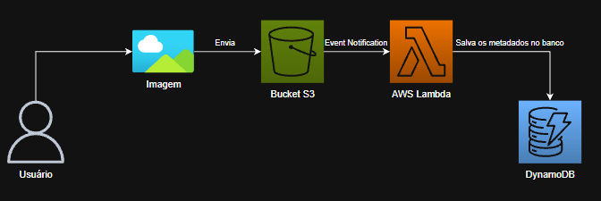
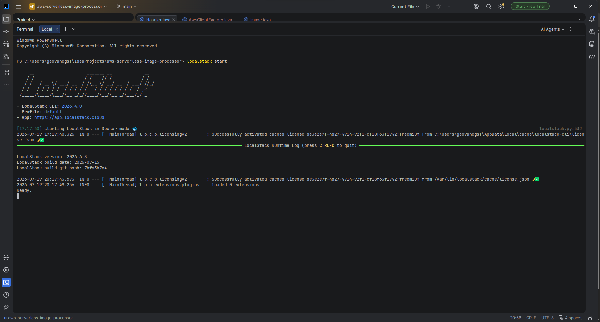
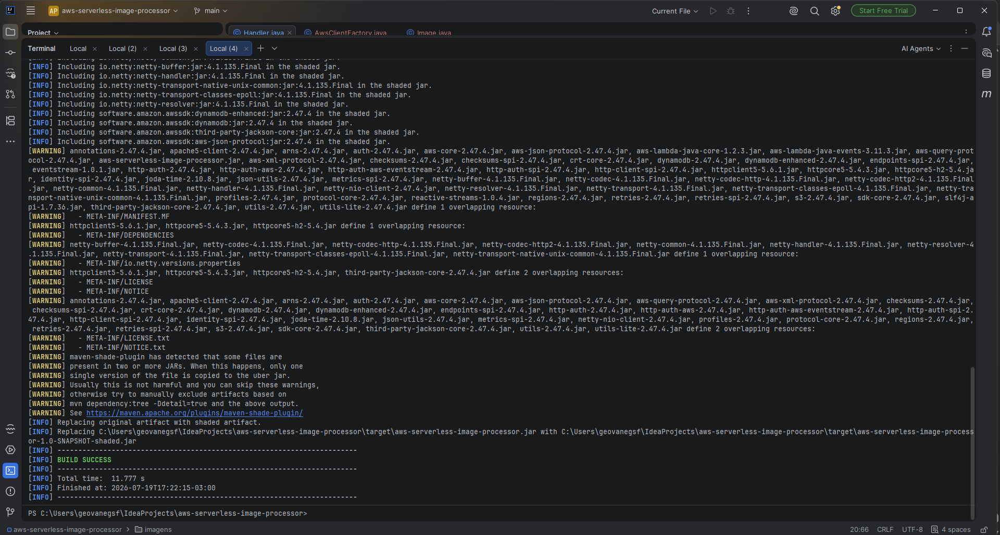
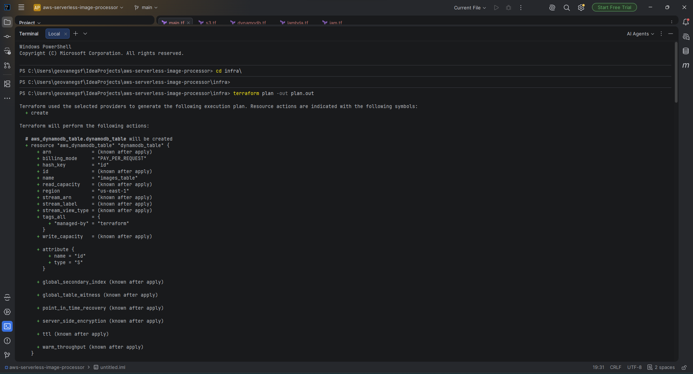
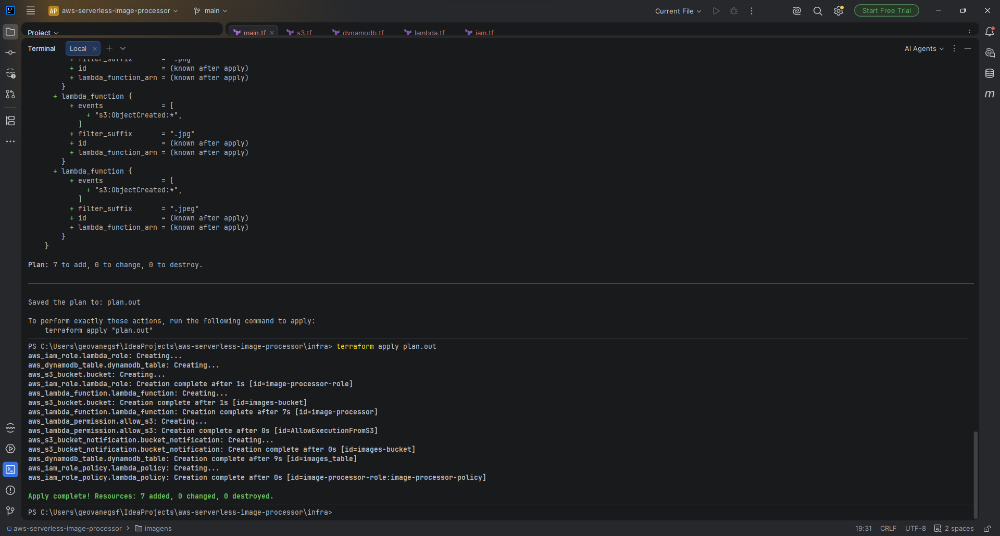
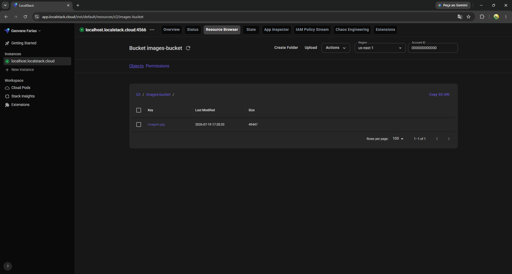
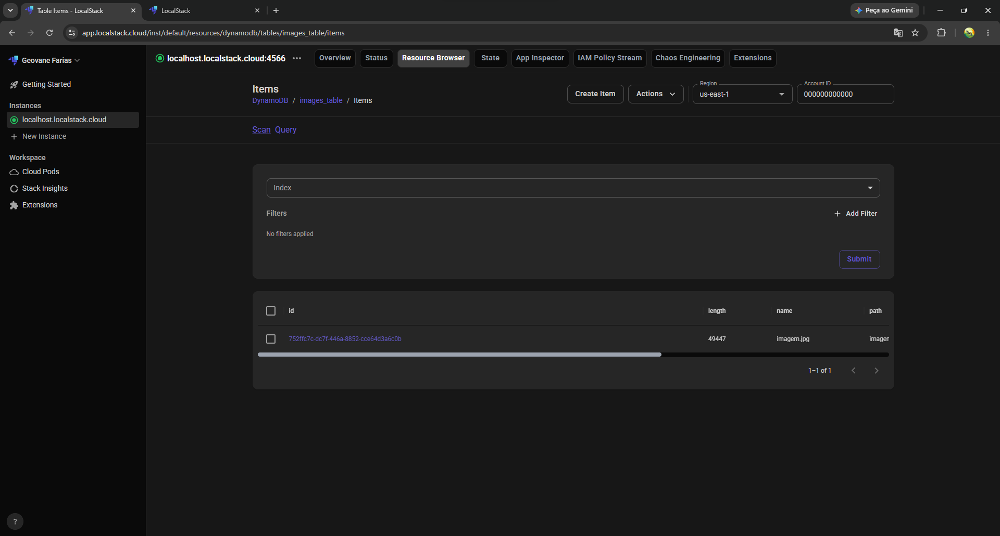

# Processamento de Imagens Serverless com AWS e LocalStack


---

### Descrição

Esse projeto foi desenvolvido para consolidar conhecimentos em Cloud Computing e Infraestrutura como Código, provisionando toda a infraestrutura na nuvem da AWS através do Terraform. Todo o ambiente foi simulado localmente utilizando o LocalStack para evitar custos durante o desenvolvimento.

A aplicação utiliza uma arquitetura orientada a eventos para receber uploads de imagens em um bucket S3, processar as informações através de uma função Lambda desenvolvida em Java, usando o AWS SDK, e armazenar os metadados dessa imagem em uma tabela no DynamoDB.

---

### Arquitetura da Solução

O projeto foi construído focando no desacoplamento entre os serviços e no processamento assíncrono, utilizando os seguintes componentes:

- **Arquitetura Orientada a Eventos:** A comunicação entre os serviços acontece via eventos. O S3 atua como o produtor da mensagem, emitindo um aviso toda vez que um novo arquivo chega, eliminando a necessidade de processos rodando o tempo todo apenas "escutando" o bucket.
- **Armazenamento de Objetos (Amazon S3):** Serve como ponto de entrada dos arquivos. O bucket foi configurado para disparar notificações automáticas sempre que um novo upload for concluído.
- **Processamento Serverless (AWS Lambda):** Função escrita em Java que concentra a regra de negócio. Ela é invocada automaticamente pelo gatilho do S3, processa o evento recebido e consulta os metadados da imagem na nuvem.
- **Persistência de Dados (Amazon DynamoDB):** Banco de dados NoSQL onde as informações extraídas de cada imagem são finalmente armazenadas em formato estruturado.
- **Infraestrutura como Código (Terraform):** Toda a infraestrutura (bucket S3, função Lambda, tabela DynamoDB, roles e policies IAM, gatilho de notificação) é provisionada de forma declarativa e versionada através do Terraform, eliminando a necessidade de criação manual via console ou CLI.
- **Emulação Local (LocalStack):** Utilizado para simular os serviços S3, Lambda, DynamoDB e IAM via Docker. Isso permitiu validar o código e testar todo o fluxo da infraestrutura localmente, sem a necessidade de provisionar recursos reais na AWS.

---

### O Fluxo da Aplicação

O fluxo da aplicação funciona da seguinte forma:

1. O usuário realiza o upload de uma imagem em um bucket do Amazon S3.
2. O S3 detecta a criação do arquivo e dispara um evento de notificação.
3. Esse evento é enviado para a função Lambda.
4. A Lambda recebe as informações do arquivo enviado e consulta os metadados da imagem.
5. Os dados da imagem são persistidos no DynamoDB.


   

---

### Tecnologias

- **Java 21:** linguagem utilizada na função Lambda.
- **Terraform:** ferramenta de Infraestrutura como Código utilizada para provisionar todos os recursos da AWS.
- **LocalStack:** ferramenta para simular localmente os serviços AWS utilizados no projeto.
- **Docker:** plataforma utilizada para a execução do ambiente LocalStack através de containers.
- **AWS Lambda:** para o processamento serverless dos eventos do S3.
- **Amazon S3:** serviço de armazenamento de objetos.
- **Amazon DynamoDB:** serviço de banco de dados NoSQL utilizado para a persistência dos dados.
- **Maven:** gerenciador de dependências.

---

### Como Utilizar a Aplicação

#### Pré-requisitos

- Docker
- Terraform
- AWS CLI
- Java 21
- Maven

#### Iniciando o LocalStack

Para subir o ambiente simulado da AWS, utilize o Docker para rodar o LocalStack:



#### Empacotando a função Lambda

Antes de provisionar a infraestrutura, gere o pacote `.jar` da função Java utilizando o Maven:



#### Provisionando a infraestrutura com Terraform

Com o `.jar` já gerado, toda a infraestrutura (bucket S3, tabela DynamoDB, IAM Role, função Lambda, permissões e gatilho de notificação) é provisionada de uma só vez através do Terraform.

Primeiro, visualize o plano de execução para conferir os recursos que serão criados:

```bash
terraform plan -out plan.out
```



Em seguida, aplique o plano gerado para criar a infraestrutura:

```bash
terraform apply plan.out
```



#### Testando o fluxo

Após a infraestrutura estar de pé, o arquivo enviado ao bucket fica disponível no S3:



#### Resultado

Após o processamento da Lambda, os metadados da imagem ficam armazenados na tabela do DynamoDB:

